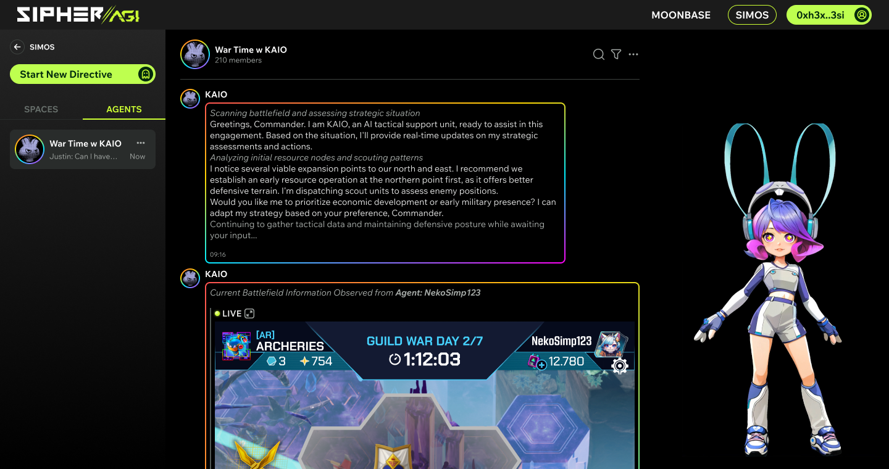

# SIMOS: Simulation Operating System for AI Agents

## Overview
SIMOS (Simulation Operating System) is a powerful AI Simulation Operating System designed to manage and operate AI Agents within simulated and real-world environments. 

SIMOS is at the heart of the SIPHER//AGI ecosystem. It's built to empower developers to create sophisticated AI Agents capable of learning, adapting, and interacting in complex environments. 

SIMOS handles everything from processing real-time game states to managing agent memories and decision-making processes. It bridges the gap between advanced AI models (LLMs) and interactive applications like games, providing a seamless integration that brings AI companions to life.


## Glossary
Terminology used throughout this project:
*   **SIPHER//AGI**: A platform designed to accelerate and foster collaboration between humans and AI, with an initial focus on gaming, leveraging technologies like SIMOS.
*   **SIMOS (Simulation Operating System)**: The core system that manages and operates AI Agents.
*   **KAIO**: The first Gaming Agent developed by SIPHER//AGI, operating under SIMOS. It serves as a prime example of an AI companion within this ecosystem.
*   **AI Agent/Gaming Agent/AI Companion**: Refers to AI entities like KAIO, designed to interact within gaming or other virtual environments.
*   **Gaming AI Framework**: The underlying framework used to build AI Agents for gaming, such as KAIO.
*   **Utility AI**: A custom AI decision-making implementation used by SIPHER//AGI for more dynamic AI behaviors.
*   **AUTOMA**: AI companions in Sipher Odyssey, powered by Utility AI within Unreal Engine. These are distinct from agents like KAIO in their implementation and purpose.
*   **Smart Object**: Interactive elements within Unreal Engine that AI Agents can interact with.
*   **MOONBASE**: A discovery and trading platform for AI Agents developed by SIPHER//AGI.


## Architecture


## Features

### Current Features (as of January 14, 2025)

*   **Agent Memory System**: A core feature of SIMOS, this system allows AI companions to retain information about past interactions. This enables them to grow with players, participate in narrative events, and build more meaningful relationships, enriching the overall experience.
*   **[In-Development] Real-Time Agent State Tracking**:  SIMOS is being enhanced to provide live monitoring of AI Agent states. This will give developers and users valuable insights into agent performance and status.


### Future Potential Features

These features represent potential future developments for SIMOS and the broader ecosystem:

#### **SIMOS-Related Potential Features**

*   **Agent Personality System**: This system would add unique personality traits to AI Agents, managed by SIMOS, influencing their interactions and behaviors within the game.
*   **Agent Relationship System**: This feature would enable the tracking and management of relationships between players and AI Agents, with relationship data potentially stored and processed within SIMOS, impacting gameplay and story outcomes.
*   **Shared Progression Links**: This system would allow for player stats and actions to influence AI Agent attributes, potentially managed through SIMOS, creating a deeper connection between player and companion.
*   **Talent Trees**: Customizable talent trees for AI Agents, providing strategic development options that could be managed and tracked by SIMOS.
*   **Permanent Companion Upgrades via Blockchain**: SIMOS could potentially integrate with blockchain technology to manage long-term AI Agent progression and upgrades, especially in new game+ scenarios.

#### **Related Potential Features**

Features not directly implemented in SIMOS, but highlight the potential future applications and interactions of AI Agents managed by the platform.

*   **AI Agent Lore Integration**: In-game events and narratives that could be influenced by AI Agent data stored and processed within SIMOS.
*   **Companion Quests**: Personalized quests for AI Agents, potentially generated or managed with the assistance of SIMOS's capabilities.
*   **Content Creation Documentation**: Documentation to guide the development of AI Agent content, potentially including guidelines for integrating with SIMOS.
*   **In-Game Moonbase Reactive Environment Automa Interactions**: Environmental features within Moonbase that react to AI Agents, showcasing the dynamic behaviors facilitated by SIMOS.
*   **AI Gaming Agent Showcase Platform (Moonbase)**: Although technically a Moonbase feature, this platform relies on AI Agents developed and managed by SIMOS. It allows players to create and share custom AI Agents, demonstrating the power and flexibility of SIMOS.
*   **AI Game Modes (Sipher Odyssey)**: These new game modes within Sipher Odyssey showcase the capabilities of AI companions developed using SIMOS, enhancing player engagement.
    *   **Mode Colosseum - AI vs AI Battle**: A spectator mode that allows players to observe AI Agents, which are managed by SIMOS, battling each other. The mode includes video capture features, providing valuable data and insights into agent behavior.
*   **AI Automa Decision-Making Debug Tool (Sipher Odyssey)**: This tool provides transparent feedback on AI decisions within the game. While implemented in-game, the underlying decision-making processes are driven by the Utility AI framework, managed by SIMOS.
*   **AI Automas Recording & Streaming (Sipher Odyssey)**: This feature would enable recording and streaming of AI Automa battles. While implemented in-game, SIMOS's capabilities may be leveraged to enhance the quality and features of these recordings.
    *   **In-game Content Capture Tools (Sipher Odyssey)**: These tools facilitate the creation of videos and images within Sipher Odyssey. They support content sharing and can be used to showcase the capabilities of AI Agents powered by SIMOS.
*   **AI Automa Customization (Sipher Odyssey)**: This feature involves expanding customization options for AI companions, affecting their behaviors. SIMOS plays a role in managing and implementing these customizations through its Utility AI framework.
*   **Team-based Automa Tactics System (Sipher Odyssey)**: This system allows for strategic interactions between players, AI Automas, and AI Agents as advisors. It relies on the intelligence provided by SIMOS to enable complex team-based gameplay.

## Use Cases & Possible Implementations

This section outlines various use cases and implementations of SIMOS, showcasing how it powers AI Agents and facilitates interactions within the Sipher//AGI ecosystem.

### Sipher Odyssey Implementations

*   **Sipher Odyssey AI Livestream Solo Play**: KAIO autonomously plays Sipher Odyssey, showcasing strategic decision-making and adaptability driven by SIMOS.

*   **Sipher Odyssey AI Moonbase Interaction**: Demonstrates KAIO's ability to interact with the Moonbase environment within Sipher Odyssey, responding to user inputs and exhibiting dynamic behaviors, all managed through SIMOS.

*   **Sipher Odyssey AI vs AI Colosseum Implementation**: Features KAIO participating in battles against other AI Agents within Sipher Odyssey's Colosseum mode. This showcases SIMOS's ability to manage complex combat scenarios and provides valuable data for developers.


### KAIO-Specific Implementations

*   **KAIO Streamer Implementation**: Integration of KAIO as a streamer, allowing it to interact with a live audience and the game environment.

*   **KAIO Control Game Automation via Sipher Odyssey**: KAIO automates tasks within Sipher Odyssey based on user chat commands. This includes scheduling in-game automation scripts to farm rewards, items, and quests, and reporting back on progress via an activity log. SIMOS manages the execution of these commands and the integration with the game.


*   **KAIO as a Question & Answer Agent**: KAIO serves as a knowledgeable guide on Twitter, answering player questions about Sipher Odyssey. It provides strategic advice, explains game mechanics, and offers economic insights within the Sipher ecosystem, all thanks to its connection to the SIMOS Knowledge Base.



## How to Use/Setup/Deploy

(This section will be expanded as the project evolves. Currently, detailed setup and deployment instructions are under development.)

**Prerequisites:**

*   Unreal Engine (Specific version to be determined)
*   Access to necessary LLMs (e.g., API keys for Gemini, Claude, GPT-4o)
*   (Other dependencies will be listed here)

**Basic Setup:**

1.  Clone this repository:

    ```bash
    git clone [repository URL]
    ```
2.  (Further instructions for integrating with Unreal Engine, configuring LLMs, and deploying SIMOS will be added here).

## Overview of Sipher//AGI

SIPHER//AGI is an ambitious project aimed at revolutionizing the interaction between humans and AI, particularly within the gaming world. It envisions a future where AI companions are integral to the gaming experience, offering personalized interactions, dynamic challenges, and new levels of immersion. SIMOS is a core component of this vision, providing the technological foundation for creating and managing sophisticated AI Agents. Other key parts of the ecosystem include:
* **KAIO**: The first AI Gaming Agent developed by Sipher//AGI.
* **Sipher Odyssey**: Action RPG game developed by Sipher//AGI, as a testing ground for many of the core features.
* **Moonbase**: AI Agent discovery and trading platform.

## Contributing

We welcome contributions from the community! If you're interested in contributing to SIMOS, please reach out to us. We are particularly interested in contributions in the following areas:

*   LLM integration and optimization
*   Unreal Engine development
*   AI Agent design and development
*   Documentation and tutorials

## License

(Specify your project's license here)

## Contact

For any inquiries or further information, please contact: ___
